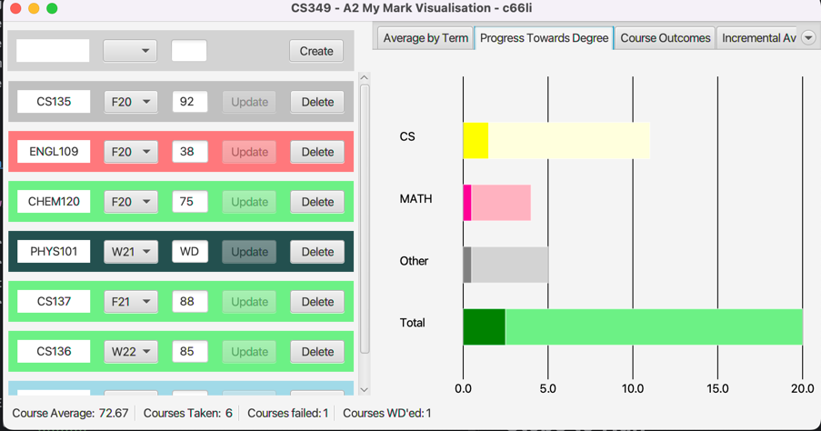

# My Mark Visualization

_UWaterloo CS329 User Interfaces (W23) Assignment 2_

This application is implemented with Model-View-Controller (MVC) design pattern using JavaFX's Widgets, Layout, Events and Shapes.
The purpose of the application is to keep track of the courses that a student has taken in their coursework and give visualizations for the courses.

## Features
- **Course Management**: Add, modify, and delete courses with fields for course code, term, and grade. Courses are listed and can be edited or deleted.
- **Statistics and Status**: View statistics including the average of taken courses, count of taken courses, count of failed courses, and count of withdrawn (WD) courses.
- **Visualizations**:
    - **Average by Term**: Displays the average grade per term using a Line & Marker chart.
    - **Progress towards Degree**: Shows progress in CS, MATH, and Other courses using a horizontal bar graph, indicating courses completed and remaining.
    - **Course Outcomes**: Presents course outcomes in a pie chart categorized by grades and WD status.
    - **Incremental Average**: Similar to Average by Term, but includes cumulative averages up to each term and standard deviation error bars.
- **Responsive Design**: User interface adjusts automatically to window resizing, ensuring a consistent and symmetric layout.

## Screenshot

## Steps to Run

1. Clone the repository:
2. Open the project in IntelliJ IDEA.
3. Ensure that the Java SDK 17.0.5 is configured for the project.
4. Build and run the application.

## Setup

- macOS 12.1
- IntelliJ IDEA 2022.3.1 (Community Edition)
- Java SDK 17.0.5 (temurin)

## References

References were made to the CS349 W23 public repository to implement MVC and Drawables. Specifically, the 02.MVC.Basic and 09.Drawables were referenced in the implementation of this application.